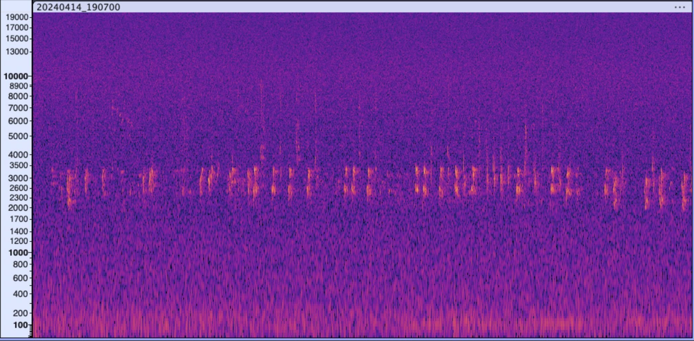

```{r setup, include=FALSE}
knitr::opts_chunk$set(
	echo = FALSE,
	message = FALSE,
	warning = FALSE,
	singlespacing = TRUE
)
library(tidyverse)
library(pander)
library(nlme)
library(mgcv)
library(hms)
library(broom)
library(here)
library(gridExtra)
output <- read_csv(here("Data/birdnet_output_filtered.csv"))
merged <- read_csv(here("Data/merged_output_deployment_filtered.csv"))
```

# Abstract

- Investigating changes in wildlife vocalization patterns due to solar eclipse
- Leveraging an AI species identifier (BirdNET) to obtain species-level data
- Goal: model community and species level response to eclipse using prescence/absence data

# Background

- Deployed 20 audio recorders (AudioMoths) in St. Lawrence County, NY

```{r, out.width="50%", fig.show="hold", echo=FALSE}
knitr::include_graphics(c("eclipse_map_red.jpg", "zoomed_audiomoths.jpeg"))
```

# BirdNET Workflow
```{r, out.width="100%"}

```

```{r, out.width = 200, fig.show="hold", fig.align="center"}
knitr::include_graphics(c( "birdnet_logo.png", "arrow.png"))
```

```{r}
output |> group_by(id) |> 
  slice(1) |> 
  ungroup() |> 
  slice(1:3) |> 
  select(1:5) |> 
  pander()
```

# Data Exploration

Determining time interval of interest

```{r}
days <- c(1:15)

## units are all in seconds since midnight

## create a vector of seconds that I want to add and subtract to and from
## the time of totality
interval_range <- (c(seq(30, 3030, by = 60)))
mid_point <- as_hms("15:25:30") |> as.numeric() ## time of totality

## convert time to seconds since midnight
merged <- merged |> mutate(time_basic = as_hms(time) |> as.numeric()) |>
  relocate(time_basic)
## only look at April 1 through 15
focused_time <- merged |> filter(day(date_time) %in% days)
```

```{r, out.width = "100%"}

filter_interval <- function(mid_point, df, interval, min_prob) {
  df |> filter(time_basic >= mid_point - interval & time_basic <= mid_point + interval) |>
    mutate(interval_size = interval * 2) |>
    filter(probability >= min_prob)
}


dfs <- map_dfr(interval_range, filter_interval,
               mid_point = as_hms("15:25:30") |> as.numeric(),
               df = focused_time, min_prob = 0.75) |>
                   mutate(day = day(date_time),
                          month = month(date_time),
                          eclipse_ind = if_else(day == "8" & month == "4",
                                                true = "eclipse",
                                        false = "non-eclipse"))


df_count <- dfs |> group_by(day, month, interval_size) |>
  summarise(n_hits = n(),
    eclipse_ind = first(eclipse_ind))


df_count <- df_count |> group_by(day, month) |>
  mutate(n_hits_lag = lag(n_hits),
         n_hits_lag = if_else(is.na(n_hits_lag), true = 0, false = n_hits_lag)) |>
  mutate(new_hits = n_hits - n_hits_lag)


ggplot(data = df_count, aes(x = interval_size, y = new_hits)) +
  geom_line(aes(group = day, colour = eclipse_ind), alpha = 0.5) +
  scale_colour_viridis_d() +
  labs(x = "Interval Around Totality (seconds)",
  y = "New Species Detections",
  colour = "Day")+
  theme_minimal()

```

Community level graph

```{r, out.width = "100%"}
# 5 day span
day1 <- ymd_hms("2024-04-06 00:00:00")
day5 <- ymd_hms("2024-04-10 23:59:59")

# eclipse time: 15:25:30
time_start <- as_hms("14:55:30")
time_end <- as_hms("15:55:30")

five_day <- merged |> filter(between(time, 
time_start, time_end)) |>
  filter(day1 <= date_time & date_time <= day5) |>
  mutate(date = as_date(date_time)) |> 
  group_by(date, id) |> # want to complete the gaps for each site/AM
  complete(time = as_hms(seq(as.numeric(time_start), as.numeric(time_end), by = 3)), 
  fill = list(value = NA)) |> 
    ungroup() |> 
    mutate(Presence = if_else(!is.na(probability),
    true = 1,
    false = 0)) |> 
      relocate(Presence, probability) |> 
      filter(seconds(time) != 57)

# whole data set
ggplot(five_day, aes(time, Presence))+
  geom_jitter(width = 0, height = 0.05)+
  geom_smooth(se = F)+
  facet_wrap(~day(date))+
  scale_x_time()+
  theme_minimal()
```

```{r, out.width = "100%"}
# spring peeper
sp_5d <- five_day |> filter(species == "Pseudacris crucifer_Spring Peeper") |>
  group_by(date, id) |> 
  complete(time = as_hms(seq(as.numeric(time_start), as.numeric(time_end), by = 3)), 
  fill = list(value = NA)) |>
  mutate(Presence = if_else(!is.na(probability),
    true = 1,
    false = 0)) |> 
  filter(seconds(time) != 57)

sp_plot <- ggplot(sp_5d, aes(time, Presence))+
  geom_jitter(width = 0, height = 0.05)+
  geom_smooth(se = F)+
  facet_grid(~day(date))+
  scale_x_time()+
  labs(title = "Spring Peeper")+
  theme_minimal()+
  theme(axis.text.x = element_text(angle = 45, hjust = 1))
  

# grackle
cgr_5d <- five_day |> filter(species == "Quiscalus quiscula_Common Grackle") |>
  group_by(date, id) |> 
  complete(time = as_hms(seq(as.numeric(time_start), as.numeric(time_end), by = 3)), 
  fill = list(value = NA)) |>
  mutate(Presence = if_else(!is.na(probability),
    true = 1,
    false = 0)) |> 
  filter(seconds(time) != 57)

cg_plot <- ggplot(cgr_5d, aes(time, Presence))+
  geom_jitter(width = 0, height = 0.05)+
  geom_smooth(se = F)+
  facet_grid(~day(date))+
  scale_x_time(guide = guide_axis(check.overlap = TRUE))+
  labs(title = "Common Grackle")+
  theme_minimal()+
  theme(axis.text.x = element_text(angle = 45, hjust = 1))

grid.arrange(sp_plot, cg_plot, ncol = 2)
```


# Modeling

```{r}
# 3 day span
day1 <- ymd_hms("2024-04-07 00:00:00")
day3 <- ymd_hms("2024-04-9 23:59:59")

# eclipse time: 15:25:30
time_start <- as_hms("14:55:30")
time_end <- as_hms("15:55:30")

mult_AMs <- c("AM0001", "AM0011", "AM0017", "AM0002", "AM0009", "AM0020")

AM_6_3d <- merged_df |> filter(deployment_num %in% mult_AMs) |> 
  filter(between(time, time_start, time_end)) |>
  filter(day1 <= date_time & date_time <= day3) |>
  mutate(date = as_date(date_time)) |> 
  group_by(deployment_num, date) |> # want to complete the gaps for each site/AM
  complete(time = as_hms(seq(as.numeric(time_start), as.numeric(time_end), by = 3)), 
  fill = list(value = NA)) |> 
    ungroup() |> 
    mutate(Presence = if_else(!is.na(probability),
    true = 1,
    false = 0)) |> 
      relocate(Presence, probability) |> 
      filter(seconds(time) != 57) |> 
      group_by(deployment_num, date) |> 
      distinct(time, .keep_all = TRUE) |> # get rid of any species at the same timestamp
      ungroup()

AM_6_3d <- AM_6_3d |> mutate(day = as_factor(day(date)),
audiomoth_day = interaction(deployment_num, day))

AM_6_3d$time_num <- as.numeric(three_day$time)
```


```{r}
load("AM_6_3d_mod.rda")
```


```{r}
grid_2 <- expand_grid(deployment_num = unique(AM_6_3d$audiomoth_day),
                     time_num = unique(AM_6_3d$time_num))


predictions_df <- augment(AM_6_3d_mod$gam, newdata = grid_2) |>
  mutate(.fitted_prob = exp(.fitted) / (1 + exp(.fitted)))

ggplot(data = predictions_df, aes(x = time_num, y = .fitted_prob)) +
  geom_line() +
  facet_wrap(~audiomoth_day)+
  

```


