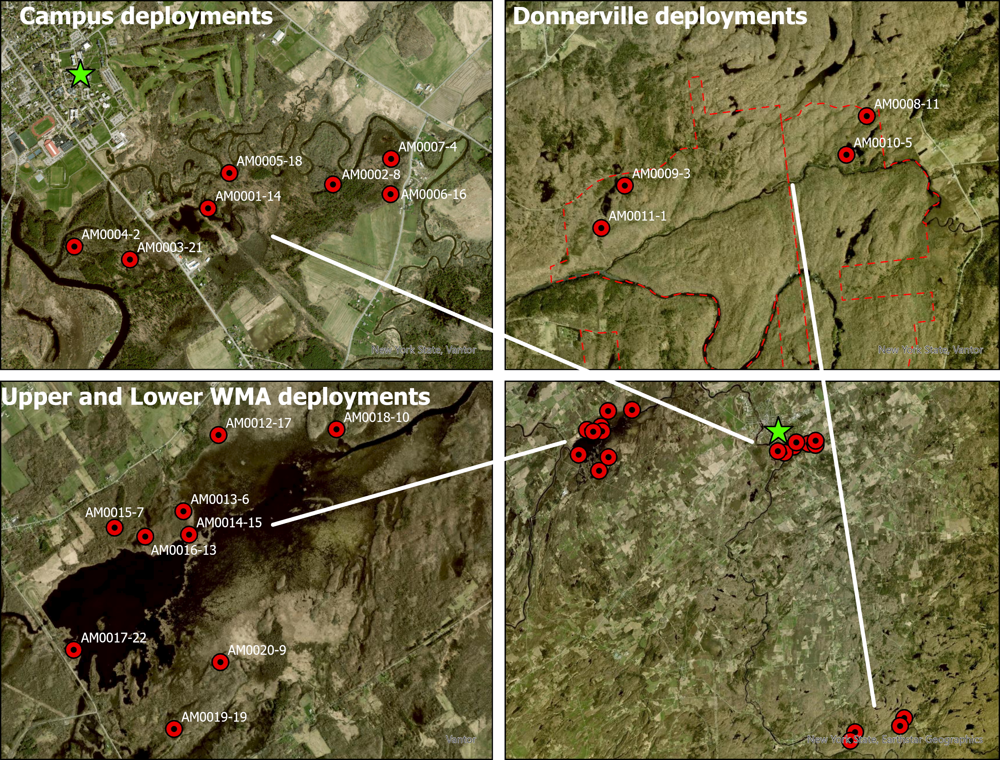
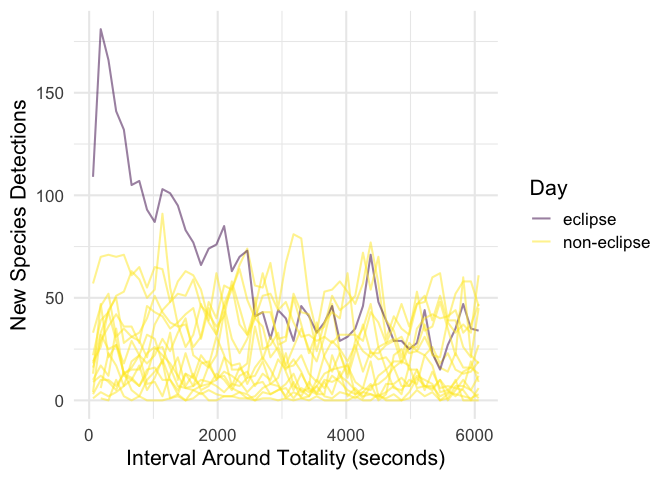
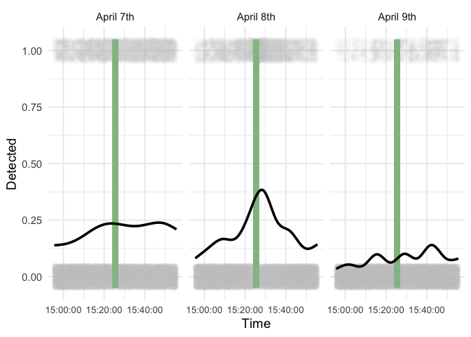
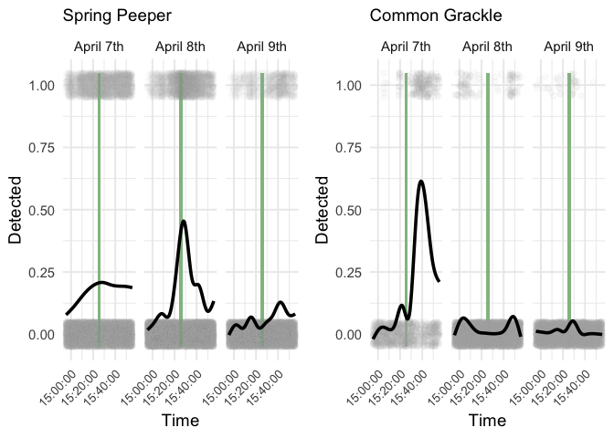
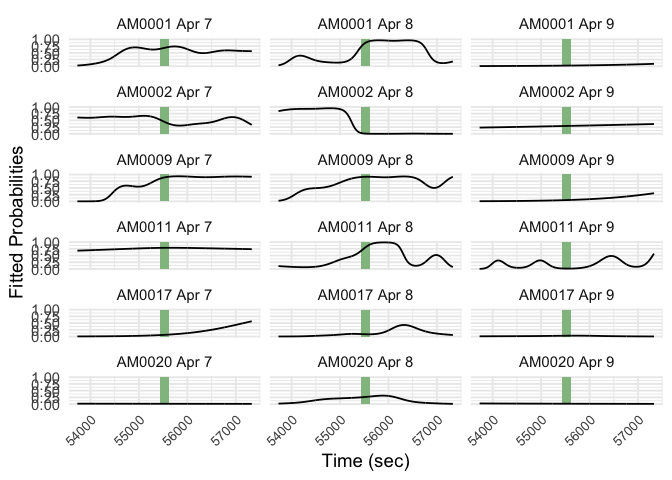

# Modeling Community & Species Level Acoustic Responses to the 2024 Eclipse

## Modeling Wildlife Responses to the 2024 Total Eclipse

This project explores the differences in vocalization activity of birds,
Anurans (frogs), and mammals in response to the eclipse. We sought to
model the community level pattern and investigate particular species to
better understand wildlife responses to rapid changes in light in their
environment.

## Methods

We used audio data collected using 20 AudioMoths deployed around in
St. Lawrence County, NY.

## Data Exploration

**Interval of Interest**

To determine the time interval that was most different on eclipse day
compared to the other days, we used the following plot:

You can see that around ± 30 around totality (1800 seconds) is where the
number of new species on eclipse day is visibly higher than the other
days. We used this as justification for the interval we picked for our
later analysis.

**Community level graph:**

Community-level vocal activity increased during eclipse, peaking at
totality (green bar).

**Species level graphs:**

We saw evidence of species behaving differently due to the eclipse. The
Spring Peeper is by far the most common species in the data set and
drives much of the pattern seen the community - level graph. The Common
Grackle had one of the more dramatic patterns, with a huge peak in calls
during totality. The birds were more idiosyncratic, but one pattern we
saw with some birds is an increase in vocalizations before and after
totality, but a complete lack of calls during totality. The Common
Grackle (below) was perhaps the most clear version of this pattern.

## Community Modeling

We used a generalized additive mixed model (GAMM) to investigate the
community-level responses to the eclipse (compared to surrounding days)
while also factoring in the site (AudioMoth). The mixed component of the
model is an AR(1) term to address temporal autocorrelation. We used a
binary response variable of the presence or absence of a call for every
3-second interval that was passed to BirdNET.

$$\operatorname{logit}(\pi_{iad}) = \beta_{ad} + f_{ad}(t_{iad}) + \epsilon_{iad}$$

Since the response variable is binary, our ‘family’ for the model was
binomial and we used a log-link function. $\pi_{iad}$ represents the
probability of detecting a species for the $i^{th}$ observation recorded
on the $a^{th}$ audiomoth ($a = 1, 2, \ldots, 6$) on the $d^{th}$ day of
recording ($d = 1, 2, 3$). $\beta_{ad}$ is the intercept for each
AudioMoth-day combination. $f_{ad}(t_{iad})$ is a smoother term for time
(indexed by $i$) that changes for each AudioMoth-day combination.
$t_{iad}$ represents the time (in seconds) that the $i^{th}$ observation
was recorded at the $a^{th}$ audiomoth and the $d^{th}$ day.
$\epsilon_{iad}$ represents random errors that follow an AR(1) temporal
correlation structure for each AudioMoth-day combination with common
shared correlation parameter $p$.

We saw that the smoothers were generally significant, meaning it was
benefitial having them in the model. Notably, all the effective degrees
of freedom (edf) values on April 8th (and the majority of site-day
combinations) were greater than 1, indicating that the species
vocalizations followed a non-linear pattern regardless of the AudioMoth
(the site). The table below displays this information for every
AudioMoth-day combination. The AR(1) parameter showed a 0.231 temporal
autocorrelation for lag 1.

|               term                |  edf  | ref.df | statistic |  p.value  |
|:---------------------------------:|:-----:|:------:|:---------:|:---------:|
| s(time_num):audiomoth_dayAM0001.7 | 6.868 | 6.868  |   12.91   |     0     |
| s(time_num):audiomoth_dayAM0002.7 | 6.71  |  6.71  |   4.903   | 2.806e-05 |
| s(time_num):audiomoth_dayAM0009.7 | 7.18  |  7.18  |   127.2   |     0     |
| s(time_num):audiomoth_dayAM0011.7 | 1.791 | 1.791  |   1.022   |  0.2888   |
| s(time_num):audiomoth_dayAM0017.7 |   1   |   1    |   57.74   |     0     |
| s(time_num):audiomoth_dayAM0020.7 |   1   |   1    |   2.767   |  0.09622  |
| s(time_num):audiomoth_dayAM0001.8 | 8.604 | 8.604  |   87.65   |     0     |
| s(time_num):audiomoth_dayAM0002.8 | 7.363 | 7.363  |    54     |     0     |
| s(time_num):audiomoth_dayAM0009.8 | 5.23  |  5.23  |   17.24   |     0     |
| s(time_num):audiomoth_dayAM0011.8 | 7.84  |  7.84  |   39.83   |     0     |
| s(time_num):audiomoth_dayAM0017.8 | 6.617 | 6.617  |   23.93   |     0     |
| s(time_num):audiomoth_dayAM0020.8 | 3.195 | 3.195  |   4.144   | 0.004662  |
| s(time_num):audiomoth_dayAM0001.9 |   1   |   1    |   34.45   |     0     |
| s(time_num):audiomoth_dayAM0002.9 |   1   |   1    |  0.3167   |  0.5736   |
| s(time_num):audiomoth_dayAM0009.9 |   1   |   1    |   194.9   |     0     |
| s(time_num):audiomoth_dayAM0011.9 | 8.448 | 8.448  |    15     |     0     |
| s(time_num):audiomoth_dayAM0017.9 | 3.16  |  3.16  |   11.29   | 1.738e-07 |
| s(time_num):audiomoth_dayAM0020.9 |   1   |   1    |  0.9676   |  0.3253   |

As seen with the smoothers and in the plot below, the day and the site
seems to result in a different pattern. We do still see the increase in
overall vocalizations on April 8th, but the patterns become more varied
from a peak at totality at different AudioMoth sites. All AudioMoths
(AM0001, AM0002, AM0009, AM0011, AM0017, AM0020) and days (April 7th -
April 9th) are displayed in the plot below.

## Conclusion

In general, we saw an increase in vocalizations in response to the
eclipse at the community level, while species reacted differently. We
saw a high level of variation in vocalization patterns on eclipse day
for each site. We believe that differences in species composition at
each site may be driving this difference in community response at each
site.

## Future Directions

We need to manually validate these data as well as run a larger model
that includes more days and all the sites (AudioMoths). We also need to
check our assumptions (ACF plots) to make sure the model is appropriate.
To truly understand the species level responses, modeling should be done
for speices of interest and groups of species (like Anurans) to
understand species level responses to the eclipse.
